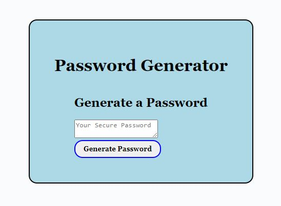

# PASSWORD GENERATOR

## Description: 
The password generator creates a randomised password.

## Usage:
When the 'generate password' button is clicked, prompt functions appear;
The first prompt asks the user how many characters they would like in the password. The user enters a number between 8-128 and presses "OK" or "cancel" on the prompt.
A 'confirm' botton alert comes up asking if they would like lowercase characters within their password, the user selects confirm for yes, or cancel for no.
A 'confirm' botton alert comes up asking if they would like uppercase characters within their password, the user selects confirm for yes, or cancel for no.
A 'confirm' botton alert comes up asking if they would like numeric characters within their password, the user selects confirm for yes, or cancel for no.
A 'confirm' botton alert comes up asking if they would like symbols within their password, the user selects confirm for yes, or cancel for no.
A password is then generated using the required variables that the user selected. The password is seen in the card body section. 

